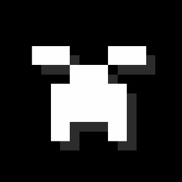

<!-- #BEGIN COPY -->
<!-- #PROPERTY NAME=TITLE -->

    

<h1 align="center">JAVA Minecraft Launcher</h1>
<!-- #END COPY -->

<!-- #BEGIN COPY -->
<!-- #PROPERTY NAME=BADGES -->

)

<!-- #END COPY -->

---

<!-- #BEGIN LANGUAGE_SWITCHER -->
[English](README.md) | **中文**
<!-- #END LANGUAGE_SWITCHER -->

## 简介

JMCL 是一款开源、跨平台的 Minecraft 启动器，支持模组管理、游戏自定义、游戏自动安装 (Forge、NeoForge、Cleanroom、Fabric、Legacy Fabric、Quilt、LiteLoader 和 OptiFine)、整合包创建、界面自定义等功能。

JMCL 有着强大的跨平台能力。它不仅支持 Windows、Linux、macOS、FreeBSD 等常见的操作系统，同时也支持 x86、ARM、RISC-V、MIPS、LoongArch 等不同的 CPU 架构。你可以使用 JMCL 在不同平台上轻松地游玩 Minecraft。

如果你想要了解 JMCL 对不同平台的支持程度，请参见 [此表格](PLATFORM_zh.md)。

## 下载

你可以从这些渠道下载 JMCL：

- [GitHub Release](https://github.com/Open-code-Studio/JMCL/releases)

## 参与贡献

JMCL 是一个社区驱动的开源项目，欢迎任何人参与贡献代码或提出建议。

你可以通过以下方式参与 JMCL 的开发：

- 通过在 GitHub 上[创建 Issue](https://github.com/Open-code-Studio/JMCL/issues/new/choose) 来报告 Bug 或提出功能请求。
- 通过在 GitHub 上 Fork 仓库并[提交 Pull Request](https://github.com/Open-code-Studio/JMCL/compare) 来贡献代码。

在参与贡献前，请阅读[贡献指南](./Contributing_zh.md)，其中包含以下内容：

- [如何从源码构建并运行 JMCL](./Contributing_zh.md#构建-hmcl)
- [通过调试选项调整 JMCL 的行为](./Contributing_zh.md#调试选项)

## 贡献者

自 2026 年以来，JMCL 已经有超过 1 位贡献者参与其中，感谢他们的辛勤付出！

## 开源协议

该程序在 [GPLv3](https://www.gnu.org/licenses/gpl-3.0.html) 开源协议下发布，同时附有以下附加条款。

### 附加条款 (依据 GPLv3 开源协议第七条)

1. 当你分发该程序的修改版本时，你必须以一种合理的方式修改该程序的名称或版本号，以示其与原始版本不同。(
   依据 GPLv3, 7(c))该程序的名称及版本号可在 Metadata.java 修改。

2. 你不得移除该程序所显示的版权声明。
